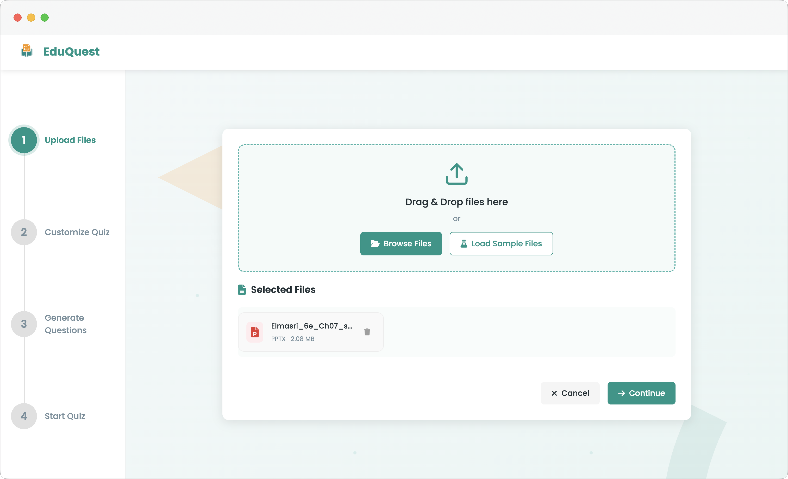
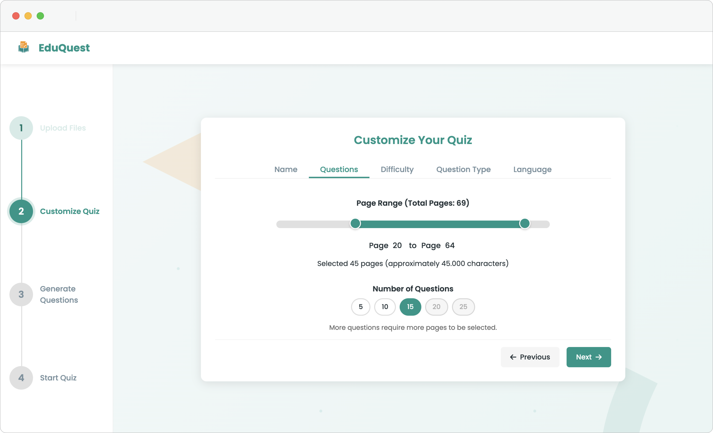
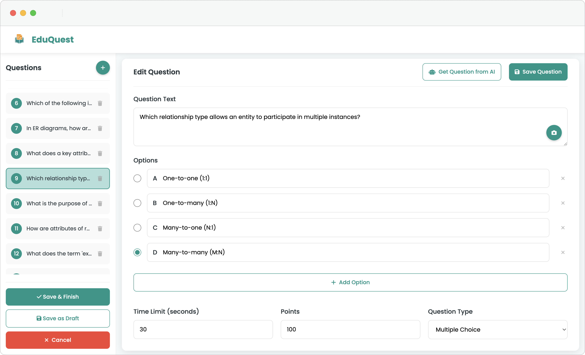
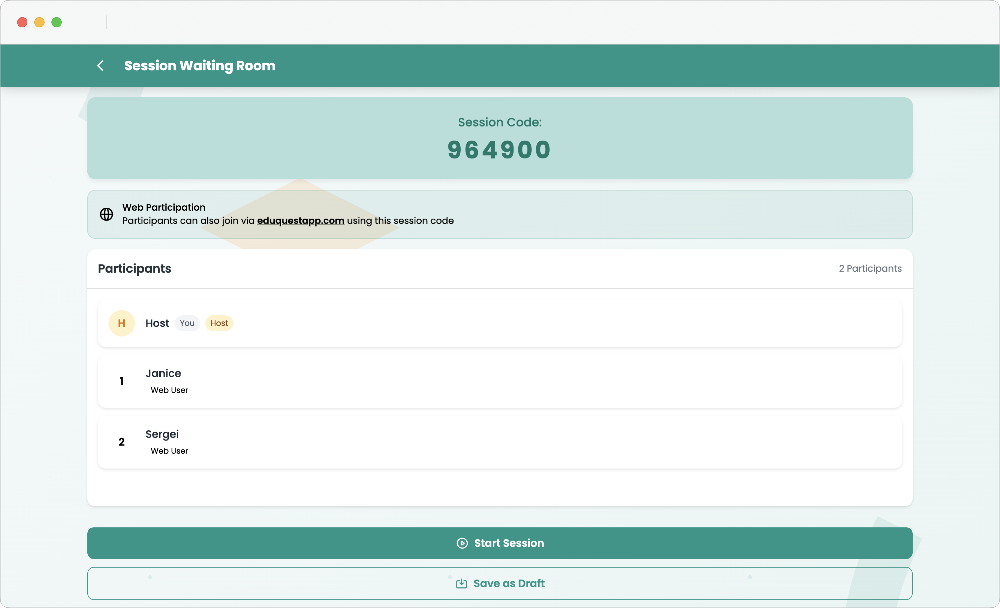

# EduQuest Web 🌐 – AI-Powered Quiz Generator from PDF & PPTX

**EduQuest Web** is the fully redesigned and feature-extended web version of the EduQuest mobile app, tailored for browser-based use. Built using **HTML**, **CSS**, **JavaScript**, and powered by **Firebase (Authentication, Firestore, Cloud Functions)**, this platform enables users to effortlessly turn educational documents into interactive quizzes using AI.

---

## 🚀 What is EduQuest?

EduQuest revolutionizes how you study by turning PDFs and PowerPoint files into fully customizable quizzes. While the mobile version focuses on quick AI generation and self-practice, this web version expands that vision for educators, learners, and institutions looking for a rich and collaborative learning environment.

---

## ✨ Key Features

### 📚 EduQuest Mode
- **Upload Multiple PDFs or PPTs**
- **AI-Generated Questions** in seconds
- Customize:
  - Question types (Multiple Choice, True/False, and more coming soon)
  - Difficulty level
  - Specific page ranges
  - Output language
- **Progress Tracker**: Review quiz history and success rate

### 🏆 EduChallenge Mode
- **Live Quiz Sessions**: Kahoot-style battles
- **Web Access**: Participants can join instantly at [eduquestapp.com](https://eduquestapp.com)
- **Add Images** to questions
- **Real-Time Scoreboard**

### 👨‍🏫 Classes Mode
- **Virtual Classrooms** for teachers and students
- **Announcements**, **Polls**, **AI-powered Homework**
- **Interactive Sessions** & collaborative learning tools

### 🧠 EduNotes (Upcoming)
- AI-powered **summarized study guides**
- Interactive **flashcards**, **voice summaries**, and **visual aids**

---

## 🔗 Cross-Platform Sync (Mobile + Web)

Your **EduQuest account is fully synchronized** across both the mobile and web platforms. Log in with the same credentials on [eduquestapp.com](https://eduquestapp.com) and access:

- Quizzes you’ve created on the mobile app
- Sessions you’ve joined or hosted
- Your performance history and progress dashboard

Any quiz prepared on **one platform** can be **accessed, solved, or shared** seamlessly from the other. This ensures a consistent learning experience, whether you're studying on-the-go or from your desktop.

---

## 📱💻 Responsive & Adaptive Design

EduQuest Web was built with a **mobile-first responsive design** approach, ensuring optimal usability on both smartphones and desktop screens. The UI dynamically adapts to different screen sizes with:

- Scalable typography and layout grids  
- Flexible button and card components  
- Touch-optimized interfaces for tablets and smartphones  
- Mouse and keyboard accessibility for desktops and laptops  

All design elements—including quiz forms, dashboards, and class interfaces—are dimensioned and styled to provide a **fluid and consistent experience** regardless of device. Whether you're creating a quiz from your phone or participating in a class session on your laptop, the interface stays intuitive and efficient.

---

## 🧭 How It Works – From Upload to Quiz

EduQuest Web is designed to guide users through a seamless, step-by-step process of creating quizzes from educational materials. Whether you're a teacher or a student, follow these four intuitive stages to turn any document into a powerful learning tool:

### 📤 1. Upload Your Materials  

Upload multiple files at once including **PDFs, PowerPoint presentations, and Word documents**. EduQuest supports a wide range of file formats to accommodate your learning style and resource type.

🔹 Drag & drop interface  
🔹 Multi-file upload  
🔹 Fast parsing with cloud backend

---

### ⚙️ 2. Customize Quiz Settings  

Tailor the quiz generation process to your needs with a rich set of customization options:

- Select **specific page ranges**
- Adjust **difficulty level**
- Choose **question types** (Multiple Choice, True/False)
- Set **number of questions**
- Pick the **quiz language**

---

### 🛠️ 3. Edit and Perfect  

You're in full control of the generated content:

- Add or remove questions  
- Request **new questions from AI**  
- Attach **images to questions**  
- Refine any part of the quiz until it fits your learning goals

---

### 🎯 4. Take or Share the Quiz  

Once finalized, use your quiz however you like:

- Practice **solo mode**  
- Host **interactive live quizzes**  
- Share with friends or students via **session code**  
- Compete in **Kahoot-style battles** with real-time scores

✅ **All steps are synchronized across devices**. Start on your phone, finish on your desktop—or the other way around.

---

## 💻 Tech Stack

| Layer            | Technology                                |
|------------------|--------------------------------------------|
| Frontend         | HTML, CSS, JavaScript                      |
| Backend          | Firebase (Cloud Functions, Firestore, Auth)|
| Hosting & Auth   | Firebase Hosting + Authentication          |
| AI Integration   | OpenAI API (via Cloud Functions)           |

---

## 🖼️ Screenshots

> Coming soon – interface previews of quiz setup, live session lobby, classroom dashboard, and EduNotes.

---

## 🔜 Roadmap

- [ ] Enhanced question formats (fill-in-the-blanks, match-the-pair)
- [ ] EduNotes with AI summaries and flashcards
- [ ] Team-based learning with study rooms
- [ ] Voice-assisted learning via AI-generated podcasts

---

## 🎯 Use Cases

- **Students**: Prepare smarter with AI-generated quizzes.  
- **Teachers**: Assign quizzes & track student results easily.  
- **Institutions**: Modernize content delivery & assessments.  
- **Lifelong Learners**: Learn actively from your materials.  

---

## 📬 Contact

Got feedback or suggestions?

📧 **Email:** [destek@eduquestapp.com](mailto:destek@eduquestapp.com)  
🔗 **Website:** [https://eduquestapp.com](https://eduquestapp.com)  
🔐 **Privacy Policy:** [View Here](https://eduquestapp.com/privacy-policy)

---

## 🔒 License

This project is under active development and is currently proprietary.
